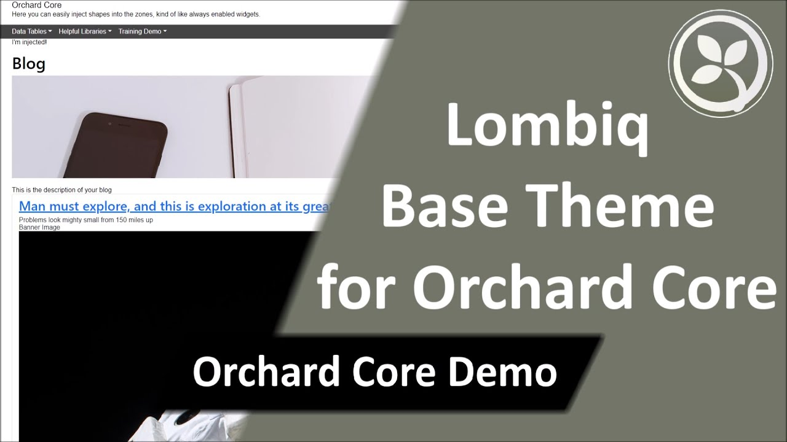

# Lombiq Base Theme for Orchard Core

  

## About

A common base theme for our Orchard Core themes using Bootstrap 5.1. It can contain any shared content that are not specific to a specific project's theme.

You can find a sample module with a commented walkthrough in this repository. Check it out [here](Lombiq.BaseTheme.Samples/Readme.md)!

Do you want to quickly try out this project and see it in action? Check it out in our [Open-Source Orchard Core Extensions](https://github.com/Lombiq/Open-Source-Orchard-Core-Extensions) full Orchard Core solution and also see our other useful Orchard Core-related open-source projects!

## Demo video

## Documentation

Use this as the base theme of any custom frontend themes you create. For instructions on how to import and override this theme with your own theme's Sass stylesheets, see the header comments in [site.scss](Assets/Styles/site.scss) and [_native-variables.scss](Assets/Styles/abstracts/_native-variables.scss).

The theme makes use of the [ICssClassHolder](Services/ICssClassHolder.cs) service which provides a scoped container for adding class names from your own code. Use the provided zone names in the [ZoneNames](Constants/ZoneNames.cs) static class to address it.

You may have noticed, that we mentioned Bootstrap 5.1, even though your version of Orchard Core may be still using Bootstrap 5.0. This theme automatically removes the built-in Bootstrap resource manifests and replaces them with the vendor's JavaScript file pulled from NPM. As the Bootstrap stylesheet is already bundled into the site stylesheet there is no need to include that in the resource manifest.

Besides the style and layout, the theme also automatically includes a minimalist helper script that eases transition away from jQuery. You don't really need full jQuery now that Internet Explorer is effectively dead (Internet Explorer 11 is going end of life on June 15, 2022 so you should not support it in any new project at this time). The script gives you the `window.helper` object. You can use `helper.ready(($) => {})` in your scripts, where `$(querySelector, baseElement)` returns a JavaScript `Array` of `Element`s.

## Recipes

- Lombiq Orchard Core Base Theme - Layers and Zones: Call this if you plan on using widgets. It sets up all the supported zones and some common layers.
- Lombiq Orchard Core Base Theme - Styling Demo: Creates a Demo Page that can be helpful to see how your theme's stylesheet behaves on various HTML elements.

## Using the NuGet package

There are a couple differences when you import from NuGet instead of a Git submodule.

- Tell Gulp to find the base theme .scss files in the NuGet package cache ([see here](https://github.com/Lombiq/Orchard-Base-Theme/blob/f2377271063d31d700cba593917195547c1654aa/Lombiq.BaseTheme.Samples/Gulpfile.js#L17-L37)).
- Use a special import call to the base style sheet in the package ([see here](https://github.com/Lombiq/Orchard-Base-Theme/blob/f2377271063d31d700cba593917195547c1654aa/Lombiq.BaseTheme.Samples/Assets/Styles/site.scss#L7-L13)). Unfortunately your IDE won't be able to reference the variables and mixins defined in the Lombiq.BaseTheme Sass files.
- Include bootstrap in your theme file's dependencies as it's not included in the NuGet package ([see here](https://github.com/Lombiq/Orchard-Base-Theme/blob/f2377271063d31d700cba593917195547c1654aa/Lombiq.BaseTheme.Samples/package.json#L7-L9)). This actually lets you select the latest version if you need some new feature. Any 5.x should work.

## Contributing and support

Bug reports, feature requests, comments, questions, code contributions and love letters are warmly welcome. You can send them to us via GitHub issues and pull requests. Please adhere to our [open-source guidelines](https://lombiq.com/open-source-guidelines) while doing so.

This project is developed by [Lombiq Technologies](https://lombiq.com/). Commercial-grade support is available through Lombiq.
